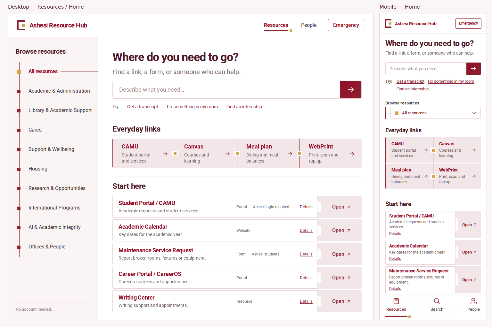

# Approved red UI implementation

These browser preview boards document the approved React/Vite layouts, with desktop on the left and mobile on the right. The current app mark and loading captures are linked below. The seven approved mockups guided the burgundy/rose/gold palette, Roboto typography, category rail, stepped action docks, page spacing and mobile navigation.

The screenshots use the actual UI areas in the reference boards: 1140 × 960 desktop and 334 × 960 mobile. Additional resource records remain accessible through the controls below the initial page composition. People shows all 27 office contacts immediately. The YAML collection and original resource destinations are unchanged.

| Page | Screenshot |
| --- | --- |
| Resources / Home | [Desktop and mobile](previews/home.png) |
| Academic & Administration | [Desktop and mobile](previews/category.png) |
| Search results | [Desktop and mobile](previews/search.png) |
| People / Offices & People | [Desktop and mobile](previews/people.png) |
| Maintenance Service Request | [Desktop and mobile](previews/detail.png) |
| Emergency | [Desktop and mobile](previews/emergency.png) |
| Flag a problem | [Desktop and mobile](previews/report.png) |

## Loading and motion

The header, category navigation, search inputs and filters render immediately. Only fetched rows, destinations and resource metadata use rose skeletons. Search text, filters and report notes remain intact when the data arrives. Failed requests show local retry controls, and the shared resource cache prevents loading flashes during subsequent navigation.

Pages and new records enter with short, staggered transitions. Desktop browsers that support it crossfade route content through React Router view transitions. Mobile uses content-only CSS entrances, so the persistent header and bottom navigation remain steady. Buttons, action arrows and form selections have subtle interaction transitions. Reduced-motion settings disable both entrances and shimmer.

[Mobile loading view](previews/loading-home-mobile.png) · [Desktop loading view](previews/loading-home-desktop.png)

## App identity and SEO

The new app mark draws on the roof, circle and three-pillar composition in Ashesi's [official logo library](https://brand.ashesi.edu.gh/university/logos) and the [meaning of its logomark](https://ashesi.edu.gh/commencement-archive/). An open book replaces the stool shape; the approved burgundy/gold app palette is retained. This is a custom Resource Hub mark. SVG, favicon, touch/app icons and a [1200 × 630 social preview](../../public/social-card.png) are included.

Route-specific HTML heads give direct visits and shared links the correct title, description, canonical URL and social card. React navigation updates the same metadata. Search, report and missing-resource views are not indexed; the sitemap contains the canonical directory/resource URLs. JSON-LD describes the directory and breadcrumbs without claiming Ashesi University publishes the app.

## Verification

`pnpm test:ui` passes. It builds the Vite SPA and generated resource dataset, validates local links/assets, captures all fourteen views, checks JavaScript errors and horizontal overflow at six widths, and exercises:

- Client-side React Router navigation and category selection without document reloads, browser back navigation, cached resource data and search after navigation.
- Exact alias intent search ("my AC is broken" resolves to Maintenance), clearing and no-result states.
- Category type filters, resource expansion, and the complete office directory without an expansion button.
- Office search and original email/telephone destinations.
- Required report reason and honest failure handling when no backend is configured.
- All four emergency telephone destinations and the Academic Affairs email hotline.
- Delayed loading on all seven pages at desktop and mobile widths, preserving interactive search/filter/report state, with no loading overflow.
- Navigation while the initial request is pending, no skeleton flashes with cached data, local retry after a failed request, and reduced-motion behavior.
- Header/bottom-navigation element identity and position across mobile route changes; no whole-document mobile View Transitions.
- Static HTML metadata without JavaScript, client-side metadata updates, canonical aliases, noindex/error recovery and the sitemap.

[Machine-readable results](verification.json) contain the viewport checks. The test intentionally builds without a live Convex URL; successful report delivery to Convex/Telegram was not exercised. The production form retains the existing `flags:create` mutation and `VITE_CONVEX_URL` configuration.

Install Chromium once using `pnpm exec playwright install chromium`, then run `pnpm test:ui`. Use Node 20 or later for the browser tooling. For an existing Chromium binary, set `UI_CHROMIUM_PATH` to its path. Screenshots are written to ignored `artifacts/ui/` by default.

